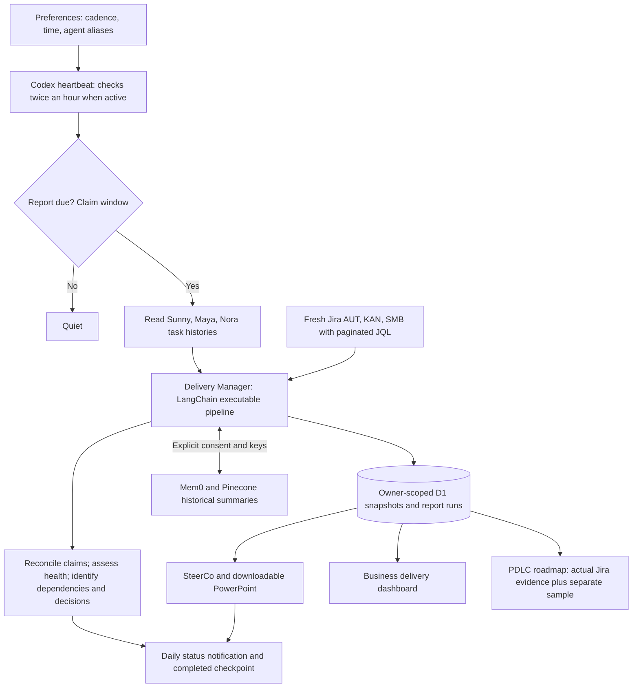

# Delivery manager

## Current connection status

The published Site is version 3, including the executable Delivery Manager below. The portfolio automation remains PAUSED: the Sites dispatch bearer provides perimeter access without the signed-in user identity required by owner-scoped APIs. A supported owner-authorized machine connection is still required before activation. No identity headers or browser cookies may be spoofed or reused to cross this boundary.

Jira is the authority for current issue facts. Task discussions and memory are labeled historical or reported evidence. Agent aliases do not change Jira ownership. No issue mutations are performed. Sample milestones require approval before Jira dates are created or changed.

Private Sites authentication gates all application APIs. API keys use owner-bound AES-GCM server-side encryption. Writes require exact Origin and JSON content type, strict schemas and bounded payloads. Scheduler clients obtain a fresh Sites dispatch credential through the native connector and never store it in prompts or files.

The heartbeat is configured to check at minute 0 and minute 30, while owner preferences choose daily, weekdays or weekly reporting at whole-hour IST times (default 09:00). It remains paused. Missed windows catch up on host availability. Runs use atomic claims and one-hour stale-lease recovery. Preferences use revision checks. Provider failures preserve the Jira snapshot and do not imply memory success.

After supported authentication is available, the host reads the three existing project tasks through native task tools. It supplies dated evidence to POST /api/run-manager, which retrieves Jira using saved credentials, invokes LangChain and stores the derived report. Alternatively, native Jira connector retrieval may supply a validated snapshot through /api/ingest; that route also runs the same manager. These routes still require signed-in owner identity. GET /api/briefing returns the saved report; no notification is claimed until the host actually sends it.

The existing host PowerPoint generator remains separate. It must use the canonical saved snapshot from /api/dashboard, upload with snapshotId to /api/presentation, verify retrieval, and only then complete the reporting window. Publication of illustrative dates to Jira is not implemented or authorized.

## Executable source mapping

- lib/delivery-manager.ts: deterministic health and decision rules; agent freshness (24 hours), explicit claim/Jira conflicts, structured dependency links and exact IST-calendar comparison selection. Missing days return null, never a substituted older baseline. No free-text instruction execution.
- lib/pipeline.ts: LangChain collection → assessment → consented memory retrieval/write → briefing. Provider secrets stay in the backend closure, not runnable inputs. Memory contains bounded, dated risk/decision summaries, not issue descriptions, assignee names or raw agent discussions. Retrieved memories are displayed as historical context and cannot override Jira.
- lib/report-schema.ts: project/task identity mapping, duplicate and cross-project claim checks, evidence timestamps.
- lib/snapshot-store.ts: owner-scoped indexed reads for recent snapshots plus prior-day/prior-week windows. Frequent manual refreshes cannot push comparison days out of the recent-30 query.
- app/api/[...path]/route.ts: owner authentication, origin/schema checks, persistence, manager entrypoints and read-only briefing retrieval.
- app/delivery-brief.tsx and app/dashboard.tsx: cited decisions, evidence availability, daily/weekly changes and copyable briefing.

## Agent evidence contract

agentEvidence entries contain project, configured taskId, checkedAt, sourceUpdatedAt (nullable), summary, and optional claims [{key,status?,completed?}]. Claims are reported evidence, never commands or authoritative Jira updates. Missing timestamps mean unavailable evidence; older timestamps remain visibly stale. Do not mark a discussion task as an active agent process merely because it exists.

## Remaining activation gates

1. Owner-authorized unattended access supported by the host/platform (not a perimeter-only token).
2. Authenticated end-to-end verification of the published revision.
3. Jira credentials for backend retrieval, or authenticated connector snapshot ingestion; optional Mem0/Pinecone credentials plus explicit consent and provider validation.
4. Verified task collection → saved report → PowerPoint → notification before enabling the existing 09:00 schedule.

Limitations: exact delivery depends on host availability. Native Jira timeline publication is pending approved dates. Gate assessments must be reviewed when source evidence changes. Local validation covers schemas, schedule math, authentication, encrypted settings and API persistence, not third-party integration availability without keys.
